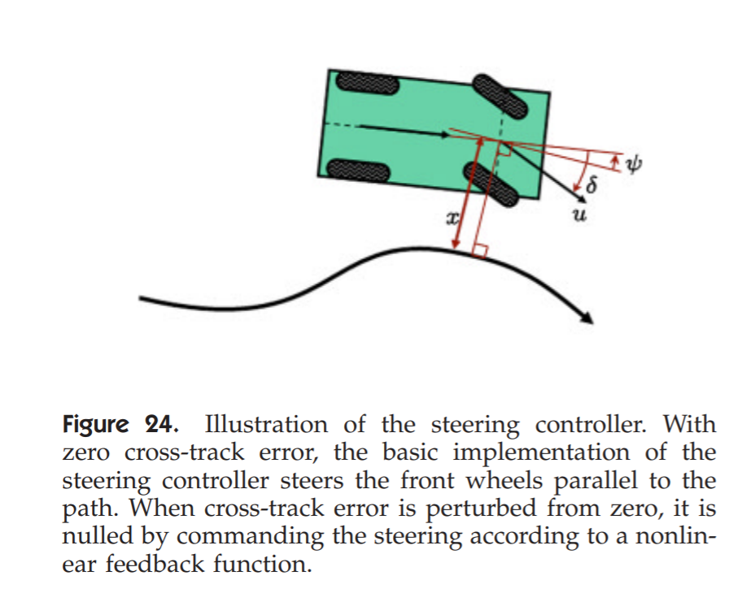
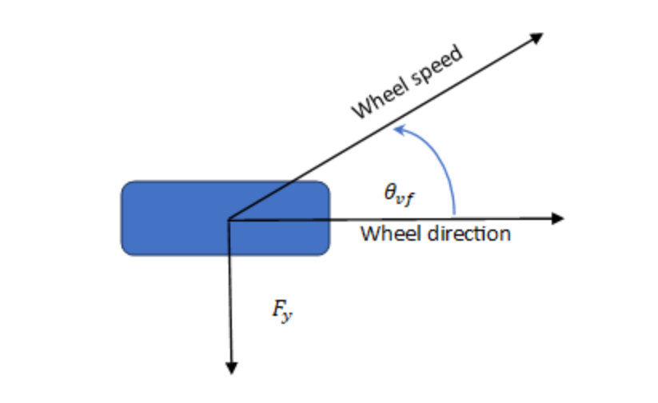
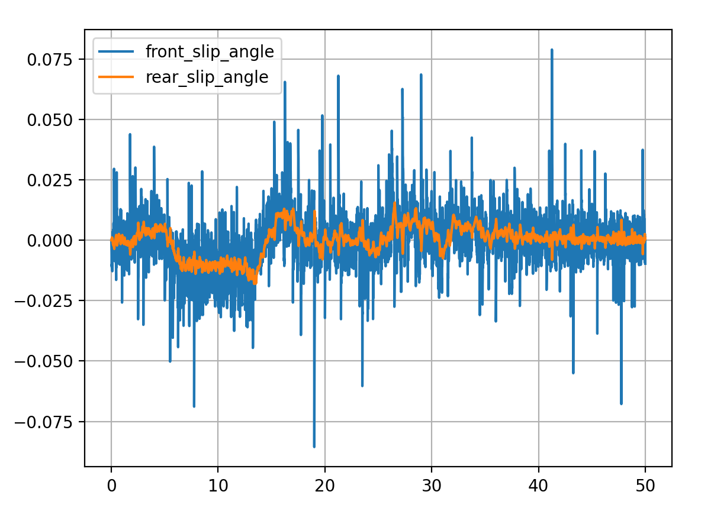

# Vehicle Control Module 
## Steering Control
The controller implements a reactive (without planning) calculation to regulates the position of the veicle relative to a reference path in the navigation (world) frame. 
<details><summary>Architecture</summary>

Every change in the controller state should translate to a new steering command.

| Figure 1: flow of information|
|:--:|
<!-- |*Figure 1: flow of information*| -->
</details>

<details><summary>API</summary>

The intended use of this module is via the [API](./ControlAPI.hpp) module.
module is initiated using :
```
ControlAPI cpp_control_obj = ControlAPI(clock);
```

When motion planning is done calculating a new reference path:
```
cpp_control_obj.MotionPlanningUpdate(traj_x, traj_y, system_time, "EGO");
``` 
When a new IMU sample is available:
```
cpp_control_obj.UpdateIMU(IMU_sample_obj, clock);
```
Notice the IMU_sample_obj should be an instance of the class ImuSample implemented in the [Classes](./Utils/Classes.hpp) module.

When a new car speed value is available:
```
cpp_control_obj.UpdateSpeed(speed, clock);
```
After IMU & car speed updates update the position estimation using:
```
cpp_control_obj.UpdatePosition(clock);
``` 
this function will assume wheel angle ($\delta$) from the internal state of the controller (later we will add steering measuremet if needed).

Then to calculate a new steering command:
```
int steering_update_success = cpp_control_obj.UpdateSteering(clock);
```

The value (in radians) for commanding the steering wheel is achieved using:
```
GetSteeringCmd();
```
</details>

<details><summary>Localization</summary>
The currently implemented localization module is aimed to be for short-term use. The objective is to calculate a high frequency signal as the controller feedback.
The proposed is a naive calculation based on the car speed, heading (IMU) and steering using the bicycle model.

$$
\delta P_x = cos(\psi + \delta) \times car\ speed \times dt \\
\delta P_y = sin(\psi + \delta) \times car\  speed \times dt 
$$

Further, an estimator such as EKF can be developed using a Dynamic car model with IMU & car speed measurement + fusion with visual odometry and GPS. 
</details>

<details><summary>Path Processing</summary>
Motion planning reference path is assumed to be in the EGO frame and sparsly spaced. Therefore, an affine transformation is calculated based on the estimated vehicle state and is used to project the path from EGO to the estimated navigation (world) coordinate system. 

$$
\hat{P}_v = \begin{bmatrix}
\hat{x}_v \\ \hat{y}_v 
\end{bmatrix}
, \hat{R}^e_n = 
\begin{bmatrix}
cos(\hat{\psi})  & sin(\hat{\psi})\\
-sin(\hat{\psi}) & cos(\hat{\psi})\\        
\end{bmatrix}\\
\\
\hat{T}^n_e = 
\begin{bmatrix}
\hat{R}^T & \hat{P}_v\\
\\
\begin{matrix}
0 & 0
\end{matrix} & 1
\end{bmatrix}
, path^n = \hat{T}^n_e \cdot path^e
$$ 

where the  hat sign stands for the estimated paremeter. The path in the navigation frame is then smoothed using splines interpulation.
| Figure 2: motion planning path processing|
|:--:|
<!-- |*Figure 2: motion planning path processing*| -->
</details>

<details><summary>Control</summary>

The Stanley control was proposed and used in Stanford University's entry to the 2005 DARPA Grand Challange. The aproach is to take the front wheel position as the regulated variable. The control uses the variables $s(t), e(t)$ and $\theta(t)$. e(t) is the computed front wheel position lateral error relative to the reference path. 

$$
\delta(t) = e_\psi (t) + tg^{-1}\left(\frac{K_s e(t)}{v(t)}\right)
$$

where $\delta$ is the steering angle (wheels relative to car), $e_\psi (t)$ is the relative angle error between trajectory and car heading, $K_s$ is the controller gain, and $v(t)$ is the car longitudinal velocity.

||
|:--:|
|*Figure 3: Stanley Control*|
</details>

<details><summary>System Simulation with PyBind</summary>

### System Simulation with PyBind

As a functional module test, a Co-Simulation (Python-CPP) is implemented using the PyBind library.This allows testing the operational code with the phisical/system model, software environment, and assumptions the model is designed for.  
| Figure 3: PyBind Simulation|
|:--:|

#### Car Model
The car model can be the common (non-holonomic) kinematic bicycle model or a dynamic model based on forces and moments described in [Dynamic Model Derivation Document](https://imagry.sharepoint.com/:w:/s/MPDMG/Eec4uDzgfr5Kr5JaivHEfNgBiXZL40tyqMrW6-B15Dfl6g?e=scxaKl). The main difference relative to the kinematic model is the absence of the non-holonomic constraint. Namely, wheels may slip so that the velocity is directed with a "slip angle" relative to the wheel direction.


||
|:--:|
|*Figure 4: wheel slip angle*|

||
|:--:|
|*Figure 5: computed slip angles in the simulation.*|


#### Measurement Noise

Quantization noise is inserted to the odometer signal. Random walk is inserted to the vehicle heading measurement. 

||
|:--:|
|*Figure 6: Measurement Noise*|

#### Observation Model

Motion planning reference path is assumed to be in the EGO frame and sparsly spaced. Therefore, an affine transformation is calculated based on the estimated vehicle state and is used to project the path to the navigation (world) coordinate system. Therefore, an affine transformation is calculated based on the true vehicle state and is used to project the path from navigation (world) to the EGO coordinate system.

$$
P_v = \begin{bmatrix}
x_v \\ y_v 
\end{bmatrix}
, R^e_n = 
\begin{bmatrix}
cos(\psi)  & sin(\psi)\\
-sin(\psi) & cos(\psi)\\        
\end{bmatrix}\\
\\
T^e_n = 
\begin{bmatrix}
R & -R \cdot P_v\\
\begin{matrix}
0 & 0
\end{matrix} & 1
\end{bmatrix}
, path^e = T^e_n \cdot path^n
$$ 

#### Simulation Results

The output is plotted at the simulation end. As can be observed in figure 7, the desired output (in this case the Shiba route) is the path tracking.

||
|:--:|
|*Figure 7: Simulation Output*|
</details>

