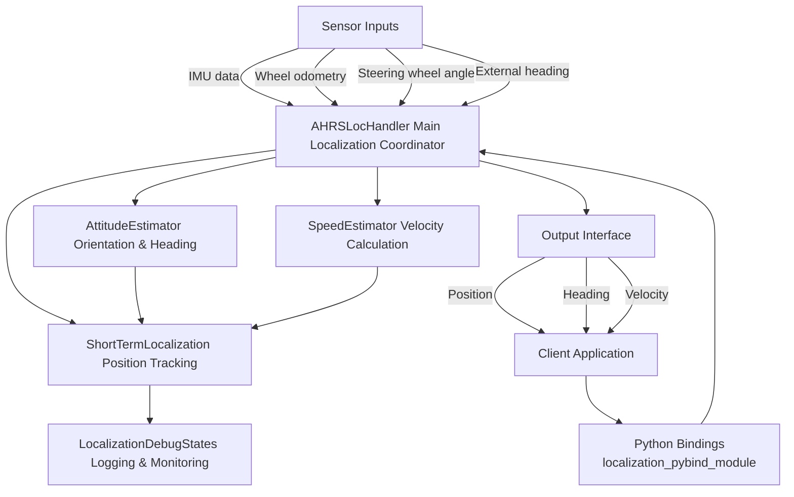

# Localization System Documentation

## 1. Module Overview - Input and Output

The Inertial Localization module is a standalone system that provides precise vehicle positioning using inertial sensors and wheel odometry data. It does not rely on GPS or other external positioning systems, making it robust for autonomous driving in GPS-denied environments.

### Input
- **IMU data**: Acceleration and angular velocity measurements
- **Wheel odometry**: Left and right rear wheel speed
- **Steering wheel angle**: Used for vehicle kinematic calculations
- **External heading** (optional): Heading reference from external source
- **Configuration files**: Vehicle parameters and localization algorithm settings

### Output
- **Position**: 2D coordinates (x, y) in meters
- **Heading**: Vehicle orientation in radians
- **Velocity**: Vehicle speed in m/s

## 2. Data Flow



## 3. Core Components

### 3.1 Localization Handler (`ahrs_loc_handler.cpp/hpp`)
- **Function**: Central coordinator that processes sensor inputs and manages localization components
- **Input**: 
  - IMU measurements (accelerometer and gyroscope data)
  - Wheel speeds (left and right rear wheels)
  - Steering wheel angle
  - External heading (optional)
- **Output**:
  - Vehicle position (x, y coordinates)
  - Vehicle heading (orientation)
  - Vehicle velocity
- **Key Methods**:
  - `UpdateIMU()`: Process new IMU data
  - `UpdateRearRightSpeed()`/`UpdateRearLeftSpeed()`: Process wheel odometry
  - `UpdateSteeringWheel()`: Update steering angle
  - `GetPosition()`: Retrieve current position
  - `GetVehicleHeading()`: Retrieve current heading

### 3.2 Attitude and Heading Reference System (`Utils/AHRS.cpp/hpp`)
- **Function**: Determines vehicle orientation and heading
- **Input**:
  - Gyroscope data (angular velocity)
  - Accelerometer data
- **Output**:
  - Vehicle orientation (quaternion)
  - Heading information
- **Key Methods**:
  - `UpdateIMU()`: Process IMU measurements
  - `GetAttitude()`: Retrieve current attitude
  - `GetHeading()`: Retrieve current heading

### 3.3 Short-Term Localization (`Utils/short_term_localization.cpp/hpp`)
- **Function**: Handles vehicle position tracking and velocity estimation
- **Input**:
  - Heading information from AHRS
  - Speed estimates from SpeedEstimator
  - Steering angle
- **Output**:
  - Vehicle position (x, y)
  - Vehicle state (position, heading, velocity)
- **Key Methods**:
  - `UpdateDelta()`: Update steering angle
  - `UpdateHeading()`: Update vehicle heading
  - `State()`: Retrieve current localization state

### 3.4 Speed Estimator (`Utils/SpeedEstimators.cpp/hpp`)
- **Function**: Fuses sensor data to estimate vehicle speed
- **Input**:
  - IMU acceleration data
  - Wheel odometry (rear wheel speeds)
- **Output**:
  - Vehicle speed estimate
- **Key Methods**:
  - `UpdateIMU()`: Process new IMU data
  - `UpdateRearSpeeds()`: Process wheel odometry data
  - `GetEstimatedSpeed()`: Retrieve current speed estimate

### 3.5 Localization Debug States (`Utils/localization_debug_states.cpp/hpp`)
- **Function**: Provides debugging and logging capabilities
- **Input**:
  - Localization state information
  - Configuration settings
- **Output**:
  - Debug files and logs
  - Performance metrics
- **Key Methods**:
  - `SaveLocData()`: Save localization data to file
  - `CreateDirectories()`: Create necessary directories for logs

### 3.6 Static/Dynamic State Detector (`Utils/StaticDynamicTest.cpp/hpp`)
- **Function**: Determines if the vehicle is stationary or in motion
- **Input**:
  - IMU measurements (accelerometer and gyroscope)
  - Car speed
- **Output**:
  - A state: `STATIC`, `DYNAMIC`, or `NOT_INITIALIZED`
- **Key Methods**:
  - `UpdateIMU()`: Process new IMU data
  - `UpdateCarSpeed()`: Process car speed data
  - `GetState()`: Retrieve the current motion state

## 4. Python Binding Model

The Python binding layer provides a clean interface to access the C++ localization functionality from Python applications. It is implemented using pybind11.

### 4.1 Structure
- **Location**: `Tests/python/python_binding/localization_pybind_module.cpp`
- **Build System**: CMake with a dedicated build script
- **Exposed Classes**:
  - `AHRSLocHandler`: Main localization coordinator
  - `ImuSample`: Structure for IMU measurements
  - `Vec3d`: Vector for 3D data (acceleration, gyroscope)

### 4.2 Key Bound Methods
- **AHRSLocHandler Constructor**: Takes paths to configuration JSON files
- **Sensor Update Methods**:
  - `UpdateIMU(imu_sample, timestamp)`: Process IMU data
  - `UpdateRearRightSpeed(speed, timestamp)`: Update right wheel speed
  - `UpdateRearLeftSpeed(speed, timestamp)`: Update left wheel speed
  - `UpdateSteeringWheel(angle, timestamp)`: Update steering angle
  - `UpdateHeading(heading, timestamp)`: Update external heading
- **State Access Methods**:
  - `GetPosition()`: Get current position [x, y, z]
  - `GetVehicleHeading()`: Get current vehicle heading
  - `GetStaticDynamicTestState()`: Get Static/Dynamic state (0: NOT_INITIALIZED, 1: STATIC, 2: DYNAMIC)
  - `GetStaticDynamicTestSensorsFeatures()`: Get tuple `(acc_std, gyro_std, speed_mean, speed_max)`

### 4.3 Usage Example
```python
import localization_pybind_module as lm

# Create localization handler with config files
loc_handler = lm.AHRSLocHandler("vehicle_config.json", "localization_config.json")

# Create IMU sample
imu_sample = lm.ImuSample()
imu_sample.acc_ = lm.Vec3d()
imu_sample.acc_.x = 0.1  # Forward acceleration
imu_sample.acc_.y = 0.0  # Lateral acceleration
imu_sample.acc_.z = 9.8  # Vertical acceleration

# Update localization with sensor data
loc_handler.UpdateIMU(imu_sample, timestamp)
loc_handler.UpdateRearRightSpeed(5.0, timestamp)
loc_handler.UpdateRearLeftSpeed(5.0, timestamp)
loc_handler.UpdateSteeringWheel(0.1, timestamp)

# Retrieve position and heading
position = loc_handler.GetPosition()
heading = loc_handler.GetVehicleHeading()
```

### 4.4 Environment and Build Instructions

Follow these steps to build the Python module using pybind11.

- Activate the virtual environment (created under `Tests/python/`):
```bash
cd Tests/python
source vehicle_control_env/bin/activate
```

- Rebuild the module (run from `Tests/python/python_binding`):
```bash
cd python_binding
./rebuild.sh
```

- Quick verification in Python: 
cd Tests/python/python_binding/build
```python
import localization_pybind_module as lm
h = lm.AHRSLocHandler("../../../../vehicle_config.json", "../../../..localization_config.json")
print(h.GetStaticDynamicTestState())  # 0: NOT_INITIALIZED, 1: STATIC, 2: DYNAMIC
```

- Notes:
  - The build produces a shared object (.so) with an ABI suffix (e.g., `localization_pybind_module.cpython-310-x86_64-linux-gnu.so`). If the script’s final move step does not match the filename, the module will remain in the local `build/` directory. You can either set `PYTHONPATH` to that directory or adjust the script’s mv pattern to `localization_pybind_module*.so`.
  - Ensure you always run `rebuild.sh` from `Tests/python/python_binding` with the virtual environment activated.

## 5. Offline Calculation Test Script

The `carpose_offline_calculation.py` script demonstrates how to use the Python binding for processing sensor data from an AI-driver trip.

# python environment
Install venv:
cd Tests/python
sudo apt-get install python3-venv
python3 -m venv vehicle_control_env
source vehicle_control_env/bin/activate
pip install -r requirements.txt 
# to install tkiner 
sudo apt-get install python3-tk

### 5.1 Overview
- **Location**: `Tests/python/python_binding/carpose_offline_calculation.py`
- **Purpose**: Process pre-recorded sensor data to calculate vehicle trajectory
- **Input**: Trip directory containing recorded sensor data
- **Output**: Calculated vehicle trajectory and visualization

### 5.2 Key Features
- **Data Loading**: Uses `Classes.Trip` to load and organize sensor data
- **Chronological Processing**: Sorts all sensor readings by timestamp
- **Sensor Fusion**: Processes IMU, wheel speed, and steering data in sequence
- **Trajectory Comparison**: Compares calculated trajectory with reference data
- **Visualization**: Optional plot of calculated vs. reference trajectory
- **Static/Dynamic Visualization**: See `Tests/python/python_binding/static_dynamic_test_visualization.py` to visualize accelerometer, gyroscope, wheel speeds, SD features and thresholds, and SD state over time.

### 5.3 Workflow
1. Load trip data from specified directory
2. Sort sensor readings chronologically
3. Initialize localization handler with config files
4. Process each sensor reading in time order:
   - IMU data with proper unit conversion
   - Wheel speed data
   - Steering wheel angle data
5. Calculate and store vehicle position at each step
6. Compare with reference trajectory if available
7. Generate visualization and save results

### 5.4 Command Line Usage
```bash
python carpose_offline_calculation.py --trip_path /path/to/trip_data \
                                      --visualize \
                                      --output_dir ./results
```

## 6. Unit Testing with Google Test

The Inertial Localization system implements a comprehensive suite of unit tests using the Google Test framework. These tests verify the correctness of individual components and their interactions.

### 6.1 Test Suite Overview

#### 6.1.1 AttitudeEstimator Tests
- **File**: `Tests/test_AHRS.cpp`
- **Test Cases**:
  - **GyroPromotion Tests**: Verify correct rotation matrix updates along each axis
    - X-axis rotation: Confirms Euler angles [1.0,0,0] rad after applying rotation
    - Y-axis rotation: Confirms Euler angles [0,1.0,0] rad after applying rotation
    - Z-axis rotation: Confirms Euler angles [0,0,1.0] rad after applying rotation
  - **UpdateGravity Tests**: Verify correct attitude updates from accelerometer measurements
    - Tests positive and negative roll (X-axis) rotations
    - Tests positive and negative pitch (Y-axis) rotations
    - Verifies gravity vector alignment in body and navigation frames

#### 6.1.2 ShortTermLocalization Tests
- **File**: `Tests/test_short_term_localization.cpp`
- **Test Cases**:
  - **Straight Line Driving**: Tests position updates when driving at constant speed with different headings
  - **Steering Tests**: Verifies position and heading changes with steering inputs
  - **Speed Estimation**: Tests speed calculations from wheel odometry

#### 6.1.3 AHRSLocHandler Tests
- **File**: `Tests/test_ahrs_loc_handler.cpp`
- **Test Cases**:
  - **InitializationFromDefaultFiles**: Verifies handler initialization with configuration files
    - Checks initial position is at origin
    - Confirms heading estimation mode is set properly
    - Tests GetPosition() and GetVehicleHeading() functionality
  - **VehicleStateReset**: Tests the ability to reset vehicle state to known values
  - **RearWheelSpeedUpdates**: Verifies that wheel speed averaging works correctly
    - Configures handler to use "rear_average" speed estimation mode
    - Sets different speeds for left (5.2 m/s) and right (4.8 m/s) wheels
    - Confirms internal state speed is set to the average (5.0 m/s)

#### 6.1.4 StaticDynamicTest Tests
- **File**: `Tests/test_static_dynamic_test.cpp`
- **Test Cases**:
  - **Initialization**: Verifies the class initializes to the `NOT_INITIALIZED` state.
  - **StateNotInitializedUntilBuffersAreFull**: Ensures the state does not change until all data buffers are full.
  - **TransitionToStatic**: Confirms the state correctly transitions to `STATIC` when provided with low-variance sensor data.
  - **TransitionToDynamic**: A set of tests to verify the state correctly transitions to `DYNAMIC` when any of the individual sensor inputs (accelerometer, gyroscope, car speed mean, car speed max) exceed their configured thresholds.
  - **State Transitions**: Verifies correct state changes from `STATIC` to `DYNAMIC` and back to `STATIC` based on the input data stream.

### 6.2 Building the Tests

To build the unit tests from scratch:

```bash
# Create and navigate to build directory
mkdir -p cmake-bin
cd cmake-bin

# Configure the project with CMake
cmake ..

# Build the test executable
make run_tests
```

### 6.3 Running the Tests

You can run all tests or specific test cases:

```bash
# Run all tests
./Tests/run_tests

# Run a specific test suite
./Tests/run_tests --gtest_filter=AHRSLocHandlerTest.*

# Run a specific test case
./Tests/run_tests --gtest_filter=AHRSLocHandlerTest.RearWheelSpeedUpdates

# Run tests with detailed output
./Tests/run_tests --gtest_output=xml:test_results.xml
```

### 6.4 Test Output

The tests provide detailed output including:
- Success/failure status for each test case
- Detailed error messages when tests fail
- Expected vs. actual values for assertions that fail
- Exception information if thrown during test execution

## 7. Test Localization Script

The `test_localization.sh` script provides a comprehensive regression test for the localization functionality.

### 7.1 Overview
- **Location**: `/home/eranvertz/git/Inertial_Localization/Tests/test_localization.sh`
- **Purpose**: Verify localization algorithm works correctly after code changes
- **Operation**: Runs the offline calculation script and compares results with expected values

### 7.2 Key Features
- **Build Verification**: Ensures Python bindings build correctly
- **Result Validation**: Compares calculated position and heading with expected values
- **Tolerance Testing**: Accepts small differences within specified tolerance
- **Automatic Updates**: Optional flag to update expected values after intentional changes

### 7.3 Workflow
1. Build the Python binding module
2. Run the offline calculation script with a test dataset
3. Extract final position (x, y) and heading values
4. Compare against expected values with defined tolerance
5. Report success or failure with detailed error information

### 7.4 Command Line Usage
```bash
./Tests/test_localization.sh [--update-expected] [--trip-path PATH]
```


