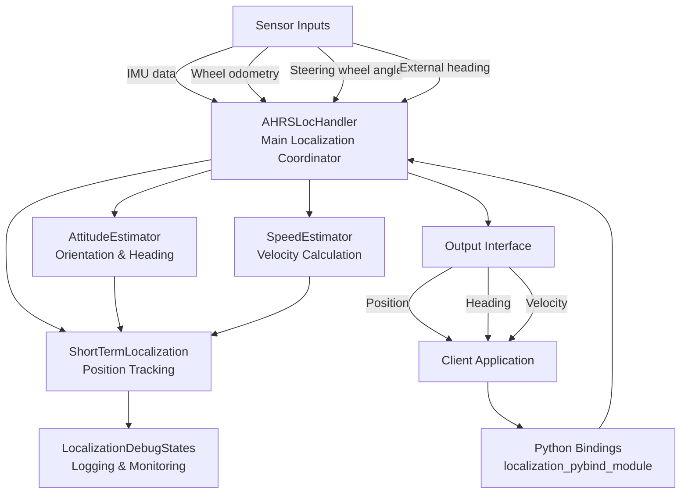

# Localization System Documentation

## 1. Module Overview - Input and Output

The Inertial Localization module is a standalone system that provides precise vehicle positioning using inertial sensors and wheel odometry data. It does not rely on GPS or other external positioning systems, making it robust for autonomous driving in GPS-denied environments.

### Input
- **IMU data**: Acceleration and angular velocity measurements
- **Wheel odometry**: Left and right rear wheel speed
- **Steering wheel angle**: Used for vehicle kinematic calculations
- **External heading** (optional): Heading reference from external source
- **Configuration files**: Vehicle parameters and localization algorithm settings

### Output
- **Position**: 2D coordinates (x, y) in meters
- **Heading**: Vehicle orientation in radians
- **Velocity**: Vehicle speed in m/s

## 2. Data Flow



## 3. Core Components

### 3.1 Localization Handler (`ahrs_loc_handler.cpp/hpp`)
- **Function**: Central coordinator that processes sensor inputs and manages localization components
- **Input**: 
  - IMU measurements (accelerometer and gyroscope data)
  - Wheel speeds (left and right rear wheels)
  - Steering wheel angle
  - External heading (optional)
- **Output**:
  - Vehicle position (x, y coordinates)
  - Vehicle heading (orientation)
  - Vehicle velocity
- **Key Methods**:
  - `UpdateIMU()`: Process new IMU data
  - `UpdateRearRightSpeed()`/`UpdateRearLeftSpeed()`: Process wheel odometry
  - `UpdateSteeringWheel()`: Update steering angle
  - `GetPosition()`: Retrieve current position
  - `GetVehicleHeading()`: Retrieve current heading

### 3.2 Attitude and Heading Reference System (`Utils/AHRS.cpp/hpp`)
- **Function**: Determines vehicle orientation and heading
- **Input**:
  - Gyroscope data (angular velocity)
  - Accelerometer data
- **Output**:
  - Vehicle orientation (quaternion)
  - Heading information
- **Key Methods**:
  - `UpdateIMU()`: Process IMU measurements
  - `GetAttitude()`: Retrieve current attitude
  - `GetHeading()`: Retrieve current heading

### 3.3 Short-Term Localization (`Utils/short_term_localization.cpp/hpp`)
- **Function**: Handles vehicle position tracking and velocity estimation
- **Input**:
  - Heading information from AHRS
  - Speed estimates from SpeedEstimator
  - Steering angle
- **Output**:
  - Vehicle position (x, y)
  - Vehicle state (position, heading, velocity)
- **Key Methods**:
  - `UpdateDelta()`: Update steering angle
  - `UpdateHeading()`: Update vehicle heading
  - `State()`: Retrieve current localization state

### 3.4 Speed Estimator (`Utils/SpeedEstimators.cpp/hpp`)
- **Function**: Fuses sensor data to estimate vehicle speed
- **Input**:
  - IMU acceleration data
  - Wheel odometry (rear wheel speeds)
- **Output**:
  - Vehicle speed estimate
- **Key Methods**:
  - `UpdateIMU()`: Process new IMU data
  - `UpdateRearSpeeds()`: Process wheel odometry data
  - `GetEstimatedSpeed()`: Retrieve current speed estimate

### 3.5 Localization Debug States (`Utils/localization_debug_states.cpp/hpp`)
- **Function**: Provides debugging and logging capabilities
- **Input**:
  - Localization state information
  - Configuration settings
- **Output**:
  - Debug files and logs
  - Performance metrics
- **Key Methods**:
  - `SaveLocData()`: Save localization data to file
  - `CreateDirectories()`: Create necessary directories for logs

## 4. Python Binding Model

The Python binding layer provides a clean interface to access the C++ localization functionality from Python applications. It is implemented using pybind11.

### 4.1 Structure
- **Location**: `Tests/python/python_binding/localization_pybind_module.cpp`
- **Build System**: CMake with a dedicated build script
- **Exposed Classes**:
  - `AHRSLocHandler`: Main localization coordinator
  - `ImuSample`: Structure for IMU measurements
  - `Vec3d`: Vector for 3D data (acceleration, gyroscope)

### 4.2 Key Bound Methods
- **AHRSLocHandler Constructor**: Takes paths to configuration JSON files
- **Sensor Update Methods**:
  - `UpdateIMU(imu_sample, timestamp)`: Process IMU data
  - `UpdateRearRightSpeed(speed, timestamp)`: Update right wheel speed
  - `UpdateRearLeftSpeed(speed, timestamp)`: Update left wheel speed
  - `UpdateSteeringWheel(angle, timestamp)`: Update steering angle
  - `UpdateHeading(heading, timestamp)`: Update external heading
- **State Access Methods**:
  - `GetPosition()`: Get current position [x, y, z]
  - `GetVehicleHeading()`: Get current vehicle heading

### 4.3 Usage Example
```python
import localization_pybind_module as lm

# Create localization handler with config files
loc_handler = lm.AHRSLocHandler("vehicle_config.json", "localization_config.json")

# Create IMU sample
imu_sample = lm.ImuSample()
imu_sample.acc_ = lm.Vec3d()
imu_sample.acc_.x = 0.1  # Forward acceleration
imu_sample.acc_.y = 0.0  # Lateral acceleration
imu_sample.acc_.z = 9.8  # Vertical acceleration

# Update localization with sensor data
loc_handler.UpdateIMU(imu_sample, timestamp)
loc_handler.UpdateRearRightSpeed(5.0, timestamp)
loc_handler.UpdateRearLeftSpeed(5.0, timestamp)
loc_handler.UpdateSteeringWheel(0.1, timestamp)

# Retrieve position and heading
position = loc_handler.GetPosition()
heading = loc_handler.GetVehicleHeading()
```

## 5. Offline Calculation Test Script

The `carpose_offline_calculation.py` script demonstrates how to use the Python binding for processing sensor data from an AI-driver trip.

### 5.1 Overview
- **Location**: `Tests/python/python_binding/carpose_offline_calculation.py`
- **Purpose**: Process pre-recorded sensor data to calculate vehicle trajectory
- **Input**: Trip directory containing recorded sensor data
- **Output**: Calculated vehicle trajectory and visualization

### 5.2 Key Features
- **Data Loading**: Uses `Classes.Trip` to load and organize sensor data
- **Chronological Processing**: Sorts all sensor readings by timestamp
- **Sensor Fusion**: Processes IMU, wheel speed, and steering data in sequence
- **Trajectory Comparison**: Compares calculated trajectory with reference data
- **Visualization**: Optional plot of calculated vs. reference trajectory

### 5.3 Workflow
1. Load trip data from specified directory
2. Sort sensor readings chronologically
3. Initialize localization handler with config files
4. Process each sensor reading in time order:
   - IMU data with proper unit conversion
   - Wheel speed data
   - Steering wheel angle data
5. Calculate and store vehicle position at each step
6. Compare with reference trajectory if available
7. Generate visualization and save results

### 5.4 Command Line Usage
```bash
python carpose_offline_calculation.py --trip_path /path/to/trip_data \
                                      --visualize \
                                      --output_dir ./results
```

## 6. Test Localization Script

The `test_localization.sh` script provides a comprehensive regression test for the localization functionality.

### 6.1 Overview
- **Location**: `/home/eranvertz/git/Inertial_Localization/test_localization.sh`
- **Purpose**: Verify localization algorithm works correctly after code changes
- **Operation**: Runs the offline calculation script and compares results with expected values

### 6.2 Key Features
- **Build Verification**: Ensures Python bindings build correctly
- **Result Validation**: Compares calculated position and heading with expected values
- **Tolerance Testing**: Accepts small differences within specified tolerance
- **Automatic Updates**: Optional flag to update expected values after intentional changes

### 6.3 Workflow
1. Build the Python binding module
2. Run the offline calculation script with a test dataset
3. Extract final position (x, y) and heading values
4. Compare against expected values with defined tolerance
5. Report success or failure with detailed error information

### 6.4 Command Line Usage
```bash
./test_localization.sh [--update-expected] [--trip-path PATH]
```


